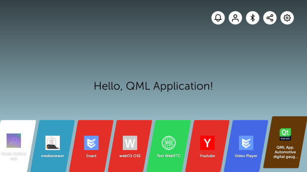

# cluster

**[WIP]**

QML automotive digital gauge cluster made for webOS OSE.

## Getting Started

These instructions will get you a copy of the project up and running on your local machine for development purpose.

### Dependencies

Below are the tools and libraries (and their minimum versions) required to build sample program:

- [qmake](https://doc.qt.io/qt-5/qmake-manual.html) (??)

### Prerequisites

Things you need to install the project :

- webOS CLI, [using npm](https://www.webosose.org/docs/tools/sdk/cli/cli-user-guide/#installing-cli) or [minimal LG installer](https://webostv.developer.lge.com/sdk/installation/download-installer/)
- a target device running webOS, it could be :
	- the [official Emulator](https://webostv.developer.lge.com/sdk/tools/emulator/introduction-emulator/#InstallingEmul),
	- a [Rapsberry Pi](https://www.webosose.org/docs/guides/getting-started/hello-webos-ose/#real-device), or
	- a [virtual machine](https://www.webosose.org/docs/tools/sdk/emulator/virtualbox-emulator/emulator-user-guide/#setting-up-the-virtual-machine-in-virtualbox)

## Running

> Here are some instructions on how to get the development env running, **if you are not familiar with CLI**, the next actions can be done with [official IDE](https://webostv.developer.lge.com/sdk/tools/ide/), [VSCode extension](https://webostv.developer.lge.com/sdk/vs-code-extension/intro-vscode/) or [SublimeText extension](https://webostv.developer.lge.com/sdk/tools/sublime-text-plugin/).

First, clone this repository with the following command :

	$ git clone https://github.com/adepreis/cluster

Then, package the app as an IPK file using :

	$ ares-package ./cluster

This should generate a package (IPK file). The created _com.github.adepreis.cluster\_<...>.ipk_ file has now to be installed on your targeted device thanks to the following command :

	$ ares-install -d <DEVICE_NAME> com.github.adepreis.cluster_<...>.ipk

with _DEVICE_NAME_ your own testing device (see `ares-setup-device` command).

Finally, run the app on device using :

	$ ares-launch -d <DEVICE_NAME> com.github.adepreis.cluster

> **Notes:**
> 
> - You can stop the app by adding a `--close` parameter to the same "launch command",
> - You can remove the app from the target by running the "install command" with `-r` parameter.

<!--

---

### How it works

...

-->

---

### Documentation / Useful links

- [Qt official documentation](https://doc.qt.io/qt-5.12/qtquick-index.html)
- [webOS OSE documentation](https://www.webosose.org/docs/home/)
- [Inspired coding style](https://github.com/Furkanzmc/QML-Coding-Guide#cs-4-animations)
