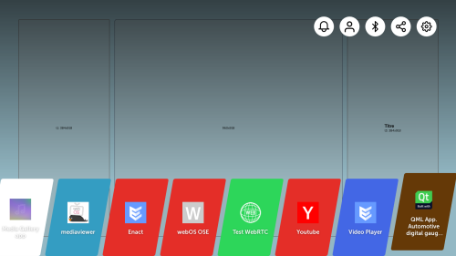
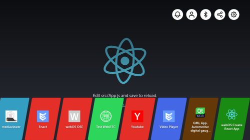

# webOS-projects

**[WIP]**

Personal projects to learn/discover development on webOS.

My objective is to create a PoC that uses React JS as an instrument-cluster solution.

## Experiments

| [cluster](./cluster) | [create-react-app](./create-react-app-webos) |
| :---------------: | :----------------------: |
|  |  |
| _Basic project to learn how to create a webOS QML app_ | _Project to learn how to create/host a React app on webOS_ |

<!--

## Built with..

Softwares and technologies :

- [QML]() - ...
- [react]() - ...

Optional equipment :

- RaspberryPi + 7" touchscreen monitor (not necessary but windows are dimensioned for it) 
-->